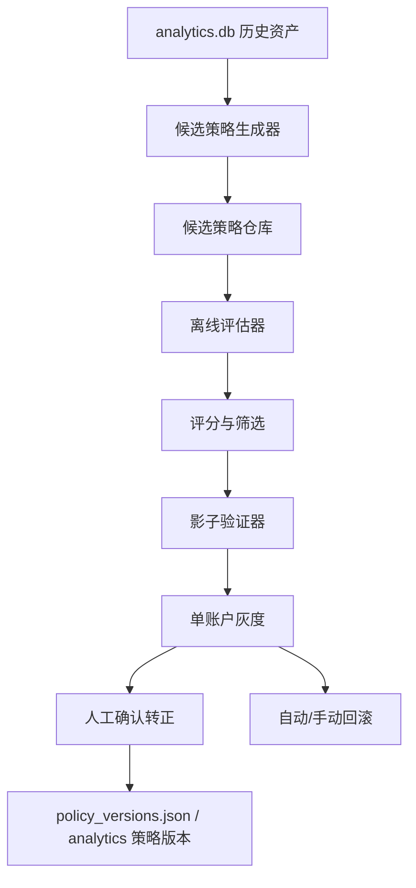

# 受控自学习 V1 技术说明书

## 1. 文档目的
本说明书定义 `codex/risk-history-v1` 分支下一阶段 `H. 受控自学习 V1` 的完整设计。

目标不是做“自动乱学”的黑盒，而是做一条可审计、可回滚、可灰度的策略演进链路：

- 基于真实历史资产提出候选策略
- 先离线评估，再影子验证
- 只允许单账户灰度
- 永远不覆盖硬风控
- 永远可回滚

这份文档是后续实现、测试、复盘、实盘灰度的主依据。

---

## 2. 阶段定位
到当前阶段，系统已经有：

1. 风控底座
- `fk1 / fk2 / fk3`
- 资金风控独立常开

2. 历史资产
- 每账户 `analytics.db`
- 盘面、决策、风控、执行、结算链路结构化

3. 复盘能力
- `fp 1~6`
- 当前盘面证据
- 链路覆盖和缺失报表

4. 动态执行能力
- 动态档位
- 任务
- 任务包

5. 策略版本能力
- `policy_versions.json`
- `policy`
- 单账户灰度 / 回滚

所以 `H` 不是从零开始，而是在这些底座之上，加一层“候选策略生成和受控验证”。

### 2.1 当前实现状态
- 已完成：`H1 候选中心`
- 已完成：`H2 候选生成器`
- 已完成：`H3 离线评估器`
- 已完成：`H4 影子验证器`
- 待实现：`H5 灰度与转正`

---

## 3. 本阶段要解决的核心问题

### 3.1 历史资产越来越多，但还没有“自动提出候选改进”的机制
现在系统能看历史、能复盘、能回写 prompt。
但仍然需要人工触发 `policy sync`，本质上还是半手工。

### 3.2 不能把大模型直接放开让它自己改
如果直接让模型自动写 prompt、自动上线，风险过高：

- 容易把偶然样本学成规律
- 容易过拟合某类盘面
- 一旦没有回滚和分级验证，会直接伤实盘

### 3.3 需要“候选 -> 离线 -> 影子 -> 灰度 -> 转正/回滚”的闭环
这是整个阶段最关键的设计原则。

---

## 4. 设计目标

### 4.1 必须做到
1. 自动提出候选策略
2. 候选策略落为结构化版本
3. 离线评估有量化结果
4. 影子验证不直接影响真钱下注
5. 只允许单账户灰度
6. 可手动转正、可手动回滚
7. 全程可追溯、可审计

### 4.2 明确不做
1. 不允许自动修改硬风控阈值
2. 不允许自动修改倍投参数、预设金额、资金口径
3. 不允许无人确认自动全量上线
4. 不允许跨账户直接共享学习结果并自动生效

---

## 5. 术语定义

### 5.1 基线策略
当前人工确认并正式使用的稳定策略版本。

### 5.2 候选策略
由历史资产和复盘引擎提出的“可能更优”的策略变体，但尚未证明可实盘。

### 5.3 离线评估
在历史数据上，用结构化事实回放候选策略表现，不碰真钱下注链路。

### 5.4 影子验证
候选策略在线运行，但只产生日志和对比结果，不参与真实下注。

### 5.5 灰度
候选策略对单一账号真实生效，用于有限风险验证。

### 5.6 转正
候选策略通过评估和灰度后，被提升为新的正式版本。

---

## 6. 设计边界

### 6.1 可学习的内容
本阶段允许学习的只是“软策略层”：

1. 盘面下的观望偏置
2. 档位上限偏置
3. 不同盘面/温度下的顺势与逆势保守程度
4. prompt 中的证据强调顺序
5. `fk1` 证据解释和档位收敛偏好
6. 任务包在某些盘面下的成员任务优先级偏好

### 6.2 不可学习的内容
本阶段明确禁止学习：

1. `fk2 / fk3 / 资金风控` 的硬保护逻辑
2. 炸停、止损、资金不足处理
3. 预设金额本身
4. 多账号统一启停策略
5. 任何会突破当前资金保护边界的参数

---

## 7. 总体架构



---

## 8. 代码模块设计

本阶段建议新增 4 个模块，职责明确，不和现有模块打架。

### 8.1 `self_learning_engine.py`
负责主流程编排：

- 生成候选
- 启动离线评估
- 记录候选状态
- 启动影子验证
- 触发灰度候选
- 给出转正建议

### 8.2 `self_learning_rules.py`
负责“从复盘事实提取候选改进方向”：

- 哪类盘面需要更强观望
- 哪类盘面高档位要更保守
- 哪类盘面顺势权重要提高
- 哪类盘面反转权重要降低

这是规则提案层，不直接操作运行链路。

### 8.3 `self_learning_eval.py`
负责离线评估：

- 用历史样本跑候选策略
- 输出覆盖率、命中率、收益、回撤、稳定性
- 和当前基线策略做对比

### 8.4 `self_learning_shadow.py`
负责影子验证：

- 在线接收当前盘面和决策
- 同时跑“当前生效策略”和“候选策略”
- 只记录差异，不改真钱执行

---

## 9. 数据存储设计

### 9.1 每账户文件
新增：

- `users/<user>/learning_center.json`

作用：

- 保存候选列表
- 当前影子候选
- 当前灰度候选
- 最近一次学习时间
- 当前阶段状态机

建议结构：

```json
{
  "version": 1,
  "active_candidate_id": "",
  "shadow_candidate_id": "",
  "last_generate_at": "",
  "last_eval_at": "",
  "candidates": []
}
```

### 9.2 analytics 表
新增 4 张表：

#### `learning_candidates`
记录每个候选：

- `candidate_id`
- `policy_base_version`
- `candidate_version`
- `candidate_type`
- `status`
- `summary`
- `change_set_json`
- `evidence_json`
- `created_at`

#### `learning_evaluations`
记录离线评估结果：

- `candidate_id`
- `eval_id`
- `sample_size`
- `coverage_rate`
- `signal_hit_rate`
- `bet_hit_rate`
- `avg_pnl`
- `max_drawdown`
- `baseline_delta_json`
- `score_total`
- `passed`
- `created_at`

#### `learning_shadows`
记录影子验证：

- `candidate_id`
- `shadow_id`
- `round_key`
- `base_policy_version`
- `candidate_version`
- `base_decision_json`
- `candidate_decision_json`
- `decision_diff_type`
- `created_at`

#### `learning_promotions`
记录灰度、转正、回滚事件：

- `candidate_id`
- `event_type`
- `target_user_id`
- `base_version`
- `candidate_version`
- `reason`
- `payload_json`
- `created_at`

---

## 10. 候选策略设计

### 10.1 候选不是完整 prompt 重写
候选策略的本质是一个“变更集”。

建议格式：

```json
{
  "candidate_id": "cand_20260307_xxx",
  "base_policy_version": "v5",
  "candidate_version": "cand-v1",
  "candidate_type": "prompt_overlay",
  "change_set": {
    "observe_bias": {
      "混乱盘": "increase",
      "反转盘": "slight_increase"
    },
    "tier_caps": {
      "衰竭盘": "yc5",
      "反转盘": "yc1"
    },
    "trend_bias": {
      "延续盘": "increase"
    },
    "temperature_bias": {
      "very_cold": "strong_observe"
    }
  }
}
```

### 10.2 候选类型
V1 只支持 3 类候选：

1. `prompt_overlay`
改变 prompt 的策略覆盖层

2. `fk1_overlay`
改变 `fk1` 的档位偏置或观望偏置

3. `task_priority_overlay`
改变任务包在特定盘面下的成员优先级偏好

V1 不支持直接修改：

- `fk2`
- `fk3`
- 资金风控
- 金额参数

---

## 11. 候选生成逻辑

### 11.1 候选来源
候选生成器只读真实资产：

- `decisions`
- `risk_records`
- `execution_records`
- `settlements`
- `regime_features`
- `policy_versions`

### 11.2 候选触发条件
只有满足这些前置条件才生成候选：

1. 最近 24h 或 7 天样本量足够
2. 链路覆盖率达标
3. 当前账户没有严重数据缺口
4. 当前策略版本运行时间足够

建议门槛：

- 真实下注结算样本 `>= 80`
- `fp 6` 链路覆盖率 `>= 95%`

### 11.3 候选生成规则
V1 先做规则驱动生成，不让模型自由发挥。

候选生成条件例子：

#### 条件 A：混乱盘高档位持续亏损
如果：

- `混乱盘`
- `yc20+` 平均收益持续为负
- 低档还能接受

则生成候选：

- 提高混乱盘观望权重
- 或把混乱盘默认限档收紧到 `yc1`

#### 条件 B：延续盘顺势明显优于逆势
如果：

- `延续盘`
- 顺势命中率和收益显著高于逆势

则生成候选：

- 延续盘顺势提示更强
- 降低证据接近时逆势概率

#### 条件 C：反转盘频繁误判
如果：

- `反转盘`
- 方向冲突明显
- 当前策略经常勉强给方向

则生成候选：

- 提高反转盘观望偏置
- 只在强证据时允许逆势

#### 条件 D：近期温度很冷时仍过于激进
如果：

- `recent_temperature = very_cold`
- 候选期间仍大量高档下注
- 回撤偏大

则生成候选：

- 很冷环境提高“观望/限档”权重

---

## 12. 离线评估设计

### 12.1 评估目标
回答一个明确问题：

> 如果候选策略在过去这批数据里存在，它会不会比当前基线更稳或更好？

### 12.2 评估对象
离线评估不是全量仿真复杂投注平台，而是基于现有结构化链路做“决策层对比”：

1. 当前基线策略的历史表现
2. 候选策略在同样盘面上的理论动作
3. 两者动作差异对收益/回撤的影响

### 12.3 评估输出指标

必须输出：

1. `sample_size`
2. `coverage_rate`
3. `signal_hit_rate`
4. `bet_hit_rate`
5. `observe_rate`
6. `tier_cap_rate`
7. `avg_pnl`
8. `total_pnl`
9. `max_drawdown`
10. `regime_stability_json`
11. `delta_vs_baseline_json`
12. `score_total`

### 12.4 评分函数
V1 使用加权评分，不只看收益。

建议：

```text
score_total =
  0.30 * pnl_score +
  0.30 * drawdown_score +
  0.20 * stability_score +
  0.10 * coverage_score +
  0.10 * explainability_score
```

解释：

- 收益重要，但不能压过回撤
- 回撤与稳定性优先级不低于收益
- 样本覆盖和解释能力必须纳入评分

### 12.5 离线通过门槛
V1 建议：

1. `sample_size >= 80`
2. `coverage_rate >= 0.95`
3. `max_drawdown` 不劣于基线
4. `total_pnl` 不显著差于基线
5. 至少在一个核心维度明显更优：
   - 更低回撤
   - 更高稳定性
   - 更少高风险误判

如果不满足，则候选停在“仅候选，不进影子”。

---

## 13. 影子验证设计

### 13.1 定义
影子验证 = 在线运行候选，但不影响真钱下注。

### 13.2 在线流程
每次到新盘面时：

1. 当前生效策略照常运行
2. 影子候选同步读取同一证据包
3. 影子候选输出自己的动作：
   - 观望 / 方向 / 档位建议
4. 记录与当前策略的差异

### 13.3 影子对比内容
每一局至少记录：

- 当前策略版本
- 候选版本
- 当前策略动作
- 候选动作
- 差异类型
- 后续真实结果

差异类型建议：

- `same`
- `observe_vs_bet`
- `tier_more_conservative`
- `tier_more_aggressive`
- `direction_diff`

### 13.4 影子通过门槛
只有满足这些条件才允许进灰度：

1. 影子样本量足够
2. 差异不是随机噪声
3. 候选在关键盘面中改善明显
4. 不出现明显增加高档风险的行为

建议门槛：

- 影子样本 `>= 50`
- 影子期间无硬风控冲突
- 影子期间“更保守但收益不明显塌陷”优先

---

## 14. 灰度设计

### 14.1 灰度范围
V1 只允许：

- 单账户灰度
- 默认从 `xu` 开始

### 14.2 灰度行为
灰度不是直接替换全部策略逻辑，而是：

- 指定账号临时切到候选策略版本
- 其他账号仍保持当前基线

### 14.3 灰度观察指标
灰度期间重点看：

1. 最大回撤
2. 24h 盈亏
3. 高档位使用情况
4. 风控触发次数
5. 盘面分类命中改善情况

### 14.4 灰度通过门槛
建议：

1. 灰度时间 `>= 24h` 或样本量 `>= 50`
2. 最大回撤较基线下降 `>= 10%`
3. 收益不明显劣于基线
4. 无硬风控违规

---

## 15. 转正与回滚

### 15.1 转正条件
只有同时满足：

1. 离线通过
2. 影子通过
3. 单账户灰度通过
4. 人工确认

才允许把候选转成正式策略版本。

### 15.2 回滚条件
出现任一情况立即回滚：

1. 灰度回撤显著劣化
2. 候选导致高档位使用明显上升且收益变差
3. 候选解释与行为不一致
4. 任何硬风控边界被间接破坏

### 15.3 默认口径
V1 明确默认：

- 不允许候选策略无人确认自动转正

这条是整个 H 阶段最重要的保护线。

---

## 16. 命令设计

V1 建议新增命令族：

- `learn`
- `learn gen`
- `learn list`
- `learn show <candidate_id>`
- `learn eval <candidate_id>`
- `learn shadow`
- `learn shadow <candidate_id> on|off`
- `learn gray <candidate_id> <账号名|ID>`
- `learn promote <candidate_id>`
- `learn rollback`

### 16.1 说明
- `learn gen`
  - 生成候选
- `learn eval`
  - 跑离线评估
- `learn shadow`
  - 查看当前影子验证状态
- `learn shadow <candidate_id> on|off`
  - 打开/关闭指定候选的影子验证
- `learn gray`
  - 对指定账号灰度
- `learn promote`
  - 人工确认转正

---

## 17. 和现有模块的关系

### 17.1 `history_analysis.py`
提供：

- 历史特征
- 盘面标签
- 证据包
- 复盘统计

### 17.2 `policy_engine.py`
提供：

- 当前策略版本体系
- prompt 回写
- 灰度激活与回滚

### 17.3 `multi_account_orchestrator.py`
提供：

- 指定账号灰度入口
- 多账号观察视图

### 17.4 `self_learning_*`
新增模块只做：

- 生成候选
- 评估候选
- 影子验证候选
- 驱动灰度/转正/回滚

---

## 18. 阶段拆分建议

为了降低实现风险，`H` 建议再拆成 5 个小阶段：

### H1 候选中心
- `learning_center.json`
- `learning_candidates` / `learning_evaluations`
- `learn list/show`

### H2 候选生成器
- 从复盘事实生成候选
- `learn gen`

### H3 离线评估器
- 离线评分
- `learn eval`

### H4 影子验证器
- 在线影子
- `learn shadow`

### H5 灰度与转正
- `learn gray`
- `learn promote`
- `learn rollback`

---

## 19. 实施顺序
实现时必须按这个顺序推进：

1. 先做候选中心和数据结构
2. 再做候选生成器
3. 再做离线评估器
4. 再做影子验证
5. 最后做灰度、转正和回滚

不能反过来。

---

## 20. 验证标准

### 20.1 代码层
- 结构化落库稳定
- 新命令可用
- 新状态字段不污染现有运行态

### 20.2 策略层
- 候选来源可解释
- 离线评分可复现
- 影子差异可追踪

### 20.3 风险层
- 无候选可绕过硬风控
- 无候选可自动全量上线
- 无候选可无人确认自动转正

---

## 21. 本阶段结论
`H` 的关键不在“让脚本自己学”，而在：

- 让它学得慢一点
- 学得可解释一点
- 学完先验证
- 验证通过再灰度
- 灰度通过再转正

只有这样，自学习才是生产能力，不是风险源。
