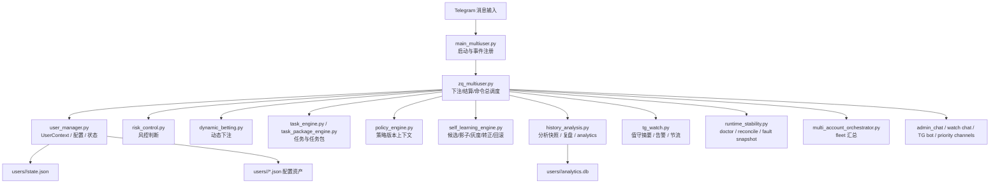
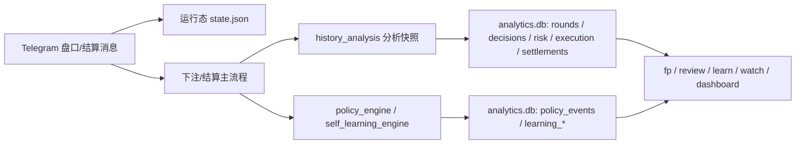
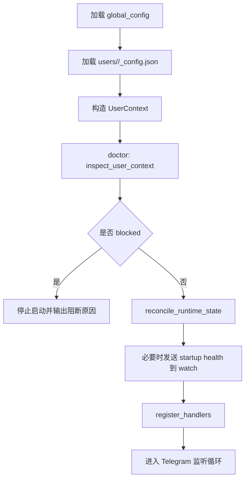
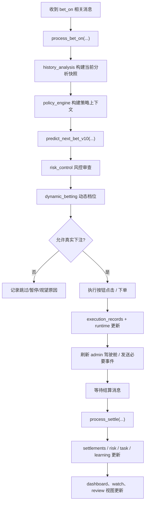
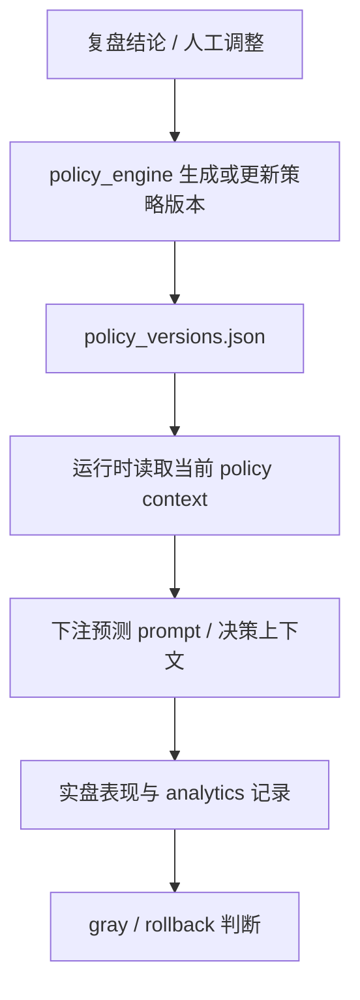
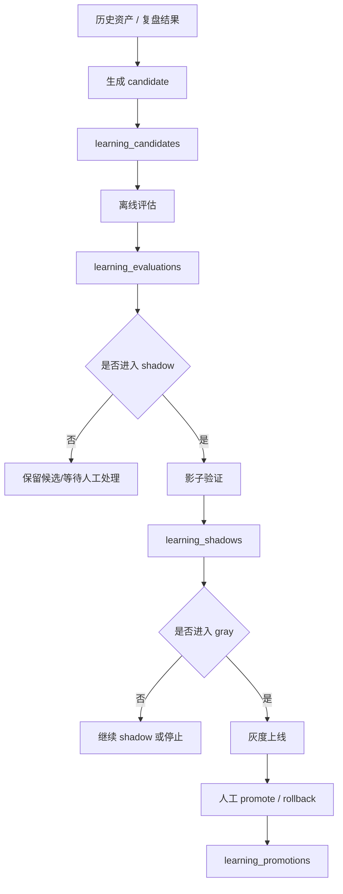
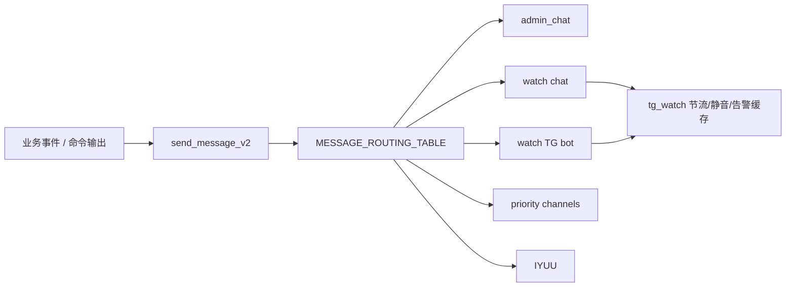

# 重构系统总技术说明书（v0.1.1）

## 1. 文档目的
这份文档是 `codex/risk-history-v1` 分支当前阶段的总技术说明书，目标不是替代各阶段技术说明，而是把已经完成的重构结果收束成一份可以长期对照、排障、回归、比对主线分支的“总主线文档”。

这份文档重点回答六类问题：

1. 这条重构分支到底由哪些模块组成，各模块边界是什么。
2. 单账号和多账号运行时，主链路是怎样流动的。
3. 从 Telegram 消息进入，到下注、结算、复盘、策略、学习、值守播报，数据是怎样流动的。
4. 系统有哪些配置、状态文件、SQLite 落库表，它们分别承担什么职责。
5. admin_chat、watch 通道、TG Bot、驾驶舱、告警消息的分发规则和更新机制是什么。
6. 当后续要排障、对比 `main`、核对行为回归时，应该沿着什么主线去看。

这份文档覆盖的系统基线为：

- 分支：`codex/risk-history-v1`
- 当前阶段基线：`A` 到 `L` 完成，`M` 已启动并落下第一批代码
- 可视为当前重构分支的初步 `v0.1.1`

---

## 2. 阅读方式
这份文档从宏观到微观展开，建议按下面顺序阅读：

1. 先看“系统定位”和“总体架构”，建立全局脑图。
2. 再看“启动链路”和“下注-结算主循环”，理解主业务闭环。
3. 然后看“消息体系”“驾驶舱”“值守播报”，理解你在 Telegram 里实际看到的东西从哪里来。
4. 再看“配置/存储/analytics”，理解每类状态落在什么地方。
5. 最后看“排障主线”“测试基线”，用于定位问题和回归验证。

如果只想快速对照行为，建议先看：

- 第 4 章 系统总览
- 第 8 章 启动与运行生命周期
- 第 9 章 下注与结算主链路
- 第 14 章 统一消息体系
- 第 15 章 Admin 驾驶舱与分层播报
- 第 19 章 排障主线

---

## 3. 系统定位与边界

### 3.1 系统定位
这个系统本质上不是一个平台化运营后台，而是一个围绕个人 Telegram 实战值守场景构建的自动化下注脚本系统。它的核心不是“做一个大而全的平台”，而是把下面这些能力用工程化的方式收拢起来：

- 单账号实盘执行
- 多账号并行编排
- 风控闭环
- 历史资产与复盘
- 动态下注
- 任务和任务包
- 策略版本化
- 受控自学习
- Telegram 值守播报与查询
- 启动自检、运行态自愈、异常快照
- admin_chat 驾驶舱

所以它的设计中心始终是：

- 脚本要能跑
- 跑的过程要能看
- 出问题要能查
- 策略变化要可灰度、可回滚
- 学习链路要受控，不能直接失控进实盘

### 3.2 明确不做的事情
为了避免这份总文档把系统讲成一个超边界的平台，需要先把边界钉死：

- 不做网页后台
- 不做复杂运营系统
- 不做多角色权限平台
- 不做自动转正、自动回滚、自动停机
- 不做云端编排服务
- 不做超出个人值守场景的大规模告警平台
- 不改变已经确认的硬风控边界

换句话说，这个系统是“工程化的个人实战脚本体系”，不是“下注 SaaS 平台”。

---

## 4. 总体架构

### 4.1 模块分层
当前分支可以抽象成七层：

1. 接入层：Telegram 客户端、消息监听、命令入口、消息发送
2. 运行上下文层：账号配置、用户目录、运行态、状态持久化
3. 业务执行层：下注预测、按钮点击、结算处理、任务推进
4. 风控与资金层：fk、暂停/恢复、动态下注、余额保护
5. 策略与学习层：policy 版本、gray/rollback、自学习候选与受控验证
6. 观测与交互层：watch、doctor、review、dashboard、alerts、fleet
7. 数据资产层：state、JSON 配置、analytics.db、日志与复盘数据

### 4.2 架构图


### 4.3 主模块与职责
下面是当前主模块的职责边界：

| 模块 | 主要职责 |
| --- | --- |
| `main_multiuser.py` | 启动用户、健康检查、注册 Telegram handler、拉起单账号运行 |
| `user_manager.py` | 加载全局配置和用户配置，封装 `UserContext`、`UserConfig`、`UserState`，负责状态持久化 |
| `zq_multiuser.py` | 主业务编排器，处理下注提示、结算消息、用户命令、消息分发、驾驶舱刷新 |
| `history_analysis.py` | 构建当前分析快照、落盘 analytics、复盘摘要、证据包、历史统计 |
| `risk_control.py` | 风控判断、标签、命中逻辑、暂停/恢复辅助 |
| `dynamic_betting.py` | 根据走势和风险状态计算下注档位与限制 |
| `task_engine.py` | 单任务执行模型 |
| `task_package_engine.py` | 多任务打包、切换、接管 |
| `policy_engine.py` | 策略版本上下文、gray、rollback、prompt 回写 |
| `self_learning_engine.py` | 候选生成、离线评估、shadow、gray、promote、rollback |
| `tg_watch.py` | watch 查询、告警聚合、静音、事件节流 |
| `multi_account_orchestrator.py` | `fleet` 相关视图和多账号观察 |
| `runtime_stability.py` | `doctor`、启动前检查、运行态修正、错误快照 |

---

## 5. 关键业务对象与统一术语
后续排障和对照时，最容易乱的是“盘、手、局、轮”这几个概念。当前分支已经明确把这些概念拆开。

### 5.1 盘
`盘` 是一次原始开奖结果刷新，是最接近外部平台原始增量的单位。

它通常对应：

- `history` 列表的一次新增
- `current_round`
- `round_key`

驾驶舱的 40 历史展示，本质上就是按“盘”展示。

### 5.2 手
`手` 是一次真实下注动作，从下单到结算闭合的最小实战单位。

它通常对应：

- 一次按钮点击
- 一次 `bet_id`
- 一次执行记录
- 一次结算记录

### 5.3 局
`局` 不是平台原始盘，而是一个业务统计区间。

它的默认闭合边界可以由这些事件触发：

- 一个任务完成
- 连输链闭合
- 自动暂停后恢复并重新起段
- 手动切换策略
- 切日

局是未来汇总“连续一段执行表现”的关键单位，也是 admin_chat 分层播报里最有业务意义的一层。

### 5.4 轮
`轮` 是一次完整执行周期。

优先语义：

- 有任务时：一轮通常对应一个 `task run`
- 没有任务时：一轮可以视为从 `st/resume` 到 `pause/finish` 的人工运行段

### 5.5 日
`日` 是自然日聚合，用于日维度收益、回撤、风控触发、学习事件等统计。

### 5.6 其他核心对象

| 对象 | 含义 |
| --- | --- |
| 预设 `preset` | 单账号执行时的参数基线 |
| 任务 `task` | 明确目标、条件和结束方式的执行单元 |
| 任务包 `package` | 多个任务的组织与切换容器 |
| 策略版本 `policy version` | 可以被 gray、promote、rollback 的策略定义版本 |
| 学习候选 `candidate` | 从复盘和历史资产中提炼出的潜在策略候选 |
| 影子验证 `shadow` | 不影响真钱下注，只做对照验证 |
| 灰度 `gray` | 在受限范围内替换基线进行小范围验证 |

---

## 6. 目录、配置与存储结构

### 6.1 仓库级结构
从当前重构结果看，仓库主要分成这些部分：

```text
YdxbotV2/
├─ config/
│  ├─ global_config.json
│  └─ global_config.example.json
├─ docs/
│  ├─ 各阶段技术说明书
│  ├─ refactor-roadmap.md
│  └─ system-technical-manual-v0.1.1.md
├─ users/
│  └─ <account>/
│     ├─ <account>_config.json
│     ├─ state.json
│     ├─ presets.json
│     ├─ tasks.json
│     ├─ task_packages.json
│     ├─ policy_versions.json
│     ├─ learning_center.json
│     ├─ analytics.db
│     ├─ decisions.log
│     └─ 其他账号私有文件
├─ tests_multiuser/
└─ *.py
```

### 6.2 用户目录是系统边界的核心
这条分支的一个关键工程化成果，是把“账号粒度的状态和资产”收束到了 `users/<account>/` 目录下。

这意味着：

- 账号之间的数据天然隔离
- 多账号并行时不会直接共用状态文件
- 排障时可以只盯一个账号目录
- 对比不同账号行为时，路径边界很清楚

### 6.3 每个账号目录里的主要文件

| 文件 | 作用 |
| --- | --- |
| `<account>_config.json` | 单账号配置入口，覆盖消息目标、账号参数、模型、通知等 |
| `state.json` | 运行态持久化，包含大量 runtime 字段 |
| `presets.json` | 预设集合 |
| `tasks.json` | 单任务定义 |
| `task_packages.json` | 任务包定义 |
| `policy_versions.json` | 策略版本资产 |
| `learning_center.json` | 自学习中心资产 |
| `analytics.db` | 结构化分析与执行记录库 |
| `decisions.log` | 决策日志类文本记录 |

### 6.4 全局配置与账号配置关系
配置并不是“只有一个全局文件”，而是“全局默认 + 用户覆盖”模型：

1. 先从 `config/global_config.json` 读取全局基线。
2. 再加载 `users/<account>/<account>_config.json`。
3. 最终合并到 `UserContext` 中供运行时使用。

这个模型的意义是：

- 全局层可以放通用模型、公共网络配置、默认消息通道
- 用户层可以覆盖账号独有的 TG、朱雀、任务、风控、模型选择

### 6.5 当前账号配置中值得特别关注的段
单账号配置里，最关键的是这些块：

- `groups`
- `notification`
- `zhuque`
- `ai` / `models`
- 账号级 preset/task/task package/policy/learning 相关文件

其中消息分发最核心的是：

```json
{
  "groups": {
    "monitor": ["me"],
    "zq_group": [-1001234567890],
    "zq_bot": 123456789,
    "admin_chat": 987654321
  },
  "notification": {
    "admin_chat": 987654321,
    "tg_bot": {
      "enable": true,
      "bot_token": "xxx",
      "chat_id": "987654321"
    },
    "watch": {
      "admin_chat": 0,
      "tg_bot": {
        "enable": true,
        "bot_token": "xxx",
        "chat_id": "987654321"
      }
    }
  }
}
```

这里要特别说明两点：

1. `notification.watch` 是独立的值守播报目标，不等于普通 `admin_chat`。
2. 当前分支已经补了“零值占位符归一化”，像 `0`、`"0"` 这类占位值会被视为无效目标，避免结构上看似配置了，实际上发送无效。

---

## 7. 数据资产与 analytics.db

### 7.1 为什么要有 analytics.db
单靠 `state.json` 和普通文本日志，不足以支撑复盘、学习、灰度、回滚、策略追踪，所以这条分支逐步把关键执行链路结构化落到了 `analytics.db`。

它解决的是三个问题：

1. 当前轮次和当前状态能不能被回看。
2. 结算之后的行为能不能被结构化分析。
3. 自学习和策略变化能不能留下证据链。

### 7.2 当前 analytics 表
当前分支在 `history_analysis.py` 中初始化的核心表包括：

| 表名 | 用途 |
| --- | --- |
| `rounds` | 原始盘面与轮次视角记录 |
| `decisions` | 模型决策、预测和理由摘要 |
| `policy_versions` | 策略版本快照 |
| `policy_events` | gray / rollback 等策略事件 |
| `learning_candidates` | 学习候选 |
| `learning_evaluations` | 候选离线评估 |
| `learning_shadows` | 影子验证样本 |
| `learning_promotions` | 灰度、转正、回滚事件 |
| `risk_records` | 风控记录 |
| `execution_records` | 真实下注执行记录 |
| `settlements` | 结算结果 |
| `regime_features` | 盘面 regime 特征 |
| `task_runs` | 任务运行记录 |
| `package_runs` | 任务包运行记录 |

### 7.3 落库与 state 的关系
可以把两者理解成两层：

- `state.json`：运行时当前态，偏“现在”
- `analytics.db`：历史证据链，偏“发生过什么”

排障时的判断原则一般是：

1. 看当前为什么这样，用 `state.json` 和驾驶舱。
2. 看它是怎么走到这里的，用 `analytics.db`。

### 7.4 结构化数据流


---

## 8. 启动链路与运行生命周期

### 8.1 启动入口
单账号运行的主入口链路是：

1. `main_multiuser.py` 读取全局配置和用户配置
2. 组装 `UserContext`
3. 运行 `runtime_stability.inspect_user_context(...)`
4. 运行 `runtime_stability.reconcile_runtime_state(...)`
5. 如果存在阻断错误，则拒绝启动主循环
6. 注册消息 handler
7. 开始监听下注提示、结算消息、命令消息、红包消息

### 8.2 启动流程图


### 8.3 启动时检查的重点
`runtime_stability.py` 当前负责的重点包括：

- 用户消息目标是否合法
- `admin_chat` / `watch` / `tg_bot` 配置是否完整
- 任务、任务包、策略、学习中心文件是否结构正常
- runtime 里 watch 状态、告警缓存、异常快照等是否能被归一化
- 占位值如 `0`、`"0"` 是否被误识别为真实 chat target

### 8.4 启动时修复的重点
`reconcile_runtime_state(...)` 不做“业务推断式修复”，只做安全范围内的整理，例如：

- 归一化 `watch_event_state`
- 归一化 `watch_alerts`
- 清理不合法或脏格式的运行态字段
- 让已经持久化但格式不稳的字段回到系统预期结构

这个原则很重要：启动自检的目标是“避免带病启动”，不是“偷偷替你更改业务行为”。

### 8.5 运行中生命周期
一个账号启动后，会进入四类事件循环：

1. 盘口/下注提示消息
2. 结算消息
3. 用户命令
4. 红包等辅助消息

而每次处理这些事件时，都会再进入下面这几个横切关注点：

- 风控
- 状态持久化
- analytics 落盘
- watch 事件与告警
- dashboard 刷新

---

## 9. 下注与结算主链路

### 9.1 主业务闭环概览
当前分支最核心的闭环是：

1. 收到新的下注提示或盘口更新
2. 从历史和当前状态构建分析快照
3. 基于策略版本、模型、任务状态生成下注建议
4. 叠加风控和动态下注约束
5. 判断是否允许真实下注
6. 如果允许，则点击按钮并记录执行
7. 等待结算消息
8. 结算后更新收益、连输链、任务推进、学习样本、驾驶舱和告警

### 9.2 主流程图


### 9.3 下注阶段的输入
下注阶段读取的主要信息包括：

- 最近历史盘面
- 当前 round / history 长度
- 上一手是否待结算
- 当前任务与任务包状态
- 当前预设与动态下注参数
- 当前风控开关与停机/暂停状态
- 当前策略版本上下文
- 学习中心当前 gray / shadow 状态
- 模型和 prompt 上下文

### 9.4 下注阶段的核心编排者
下注阶段的总编排在 `zq_multiuser.py` 的这些函数中：

- `predict_next_bet_v10(...)`
- `process_bet_on(...)`

可以把它们理解成：

- `predict_next_bet_v10(...)`：偏“生成建议”
- `process_bet_on(...)`：偏“把建议推进到真实执行链路”

### 9.5 风控与动态下注在下注前的作用
系统不会直接把模型输出变成实际点击。下注前至少要经过两类限制：

1. 风控：
   - 当前是否手动暂停
   - 是否进入自动暂停周期
   - 是否命中连续亏损保护
   - 是否有资金不足、异常状态、超时等阻断
2. 动态下注：
   - 当前盘面 regime
   - 连输阶段
   - 动态档位调整
   - 首注下限或限档

所以真正的真实下注，永远是“模型建议 + 策略约束 + 风控约束 + 下注档位约束”的结果。

### 9.6 真实下注执行
当真实下注发生时，系统会至少更新这些内容：

- 当前 runtime 的下注状态
- `bet_id` 或等价执行标识
- 当前手的方向、金额、序号
- 执行记录落库
- 必要的值守事件
- admin 驾驶舱刷新

### 9.7 结算阶段
结算是系统第二个关键入口，主要由 `process_settle(...)` 处理。

它负责把一次手真正闭合，并推动以下状态向后流：

- 盈亏
- 连输计数
- 风控阶段推进
- 任务与任务包推进
- 策略表现累计
- 学习影子样本记录
- watch 告警和 admin 驾驶舱更新

### 9.8 结算后的横向联动
一次结算通常会同时影响五个方向：

1. `runtime`：当前手闭合、收益更新、连续状态变化
2. `analytics.db`：settlement、risk、execution 等表写入
3. `task` / `package`：任务是否推进、完成、中止
4. `policy` / `learning`：候选是否追加样本、gray 是否继续、是否需要回滚提示
5. `watch` / `dashboard`：值守摘要和驾驶舱是否需要刷新

---

## 10. 风控、动态下注与资金保护

### 10.1 风控不是一个开关，而是一组链路
当前分支的风控已经不是“下注前 if 一下”，而是一整组可组合的约束机制。

关键包括：

- `fk1 / fk2 / fk3`
- 账户级基础风控与深度风控
- 自动暂停周期
- 连输链保护
- 资金保护
- 入口超时保护
- stall guard / shadow probe 等运行保护

### 10.2 运行态默认字段
`user_manager.get_default_runtime()` 提供了大批默认运行字段，用来稳定系统的初始行为。它们大致分成几类：

- 核心开关：`switch`、`manual_pause`、`open_ydx`
- 历史轮次：`current_round`、`current_bet_seq`
- 下注参数：`mode`、`initial_amount`、`bet_amount`
- 风控状态：`risk_base_enabled`、`risk_deep_enabled`、`fk1_enabled`、`fk2_enabled`、`fk3_enabled`
- 自动暂停状态：`risk_pause_*`
- 暂停倒计时与恢复：`pause_*`
- 模型监控与入口超时：`entry_timeout_gate_*`、`model_monitor_*`
- 影子探针：`shadow_probe_*`

这说明一个重要事实：

当前系统的行为大量依赖 runtime 字段，而不是只依赖函数局部变量。排障时，很多“为什么这次没下注”“为什么自动暂停没恢复”的问题，都需要沿着 runtime 去查。

### 10.3 动态下注
动态下注模块的目标不是“更激进”，而是“让下注档位更贴近当前走势、风险和阶段”。

它主要处理这些问题：

- 当前盘面适合哪个下注档位
- 连输阶段首注是否需要下限约束
- 当前是否需要保守缩档
- 动态档位是否与当前任务、风险状态冲突

### 10.4 资金保护
资金相关逻辑并不是只看余额是否大于 0，而是会参与这些分支：

- 资金不足时暂停下注
- 资金恢复后是否恢复执行
- 值守告警是否需要抛出
- admin 驾驶舱和 watch funds 如何展示

---

## 11. 任务体系与任务包体系

### 11.1 为什么需要任务
如果没有任务，脚本就只有“不断判断要不要下注”的裸循环。任务体系解决的是：

- 如何把下注行为组织成目标明确的执行段
- 何时结束
- 完成后如何切换或暂停

### 11.2 单任务
任务的核心资产是 `tasks.json`，对应 `task` 命令族。任务可以定义：

- 目标
- 阈值
- 执行方式
- 结束条件
- 运行状态

### 11.3 模板与参数覆盖
后续引入模板和模板参数覆盖后，系统把“重复创建类似任务”的成本降了下来。现在已经形成了：

- 模板
- 快速创建
- 参数覆盖
- 用户目录内保存

这让任务不仅可执行，也可复用。

### 11.4 任务包
`task_packages.json` 负责把多个任务组织成包。

任务包的意义是：

- 按盘面切换任务
- 在多任务之间接力
- 形成更高层的执行编排

### 11.5 任务链路在主循环中的位置
任务和任务包不会替代下注主循环，而是作为“上层业务编排”嵌入进去：

- 下注前影响是否应下注、用什么参数下注
- 结算后推进任务状态
- 在 watch / dashboard / fleet 中展示当前任务上下文

---

## 12. 策略版本化体系

### 12.1 策略版本为什么重要
如果没有版本化，策略只会以“当前 prompt 或当前代码逻辑”的形式存在，一旦调整，就难以回答：

- 当前到底用的是哪个策略版本
- 最近一次修改是什么
- 新版本是不是已经上线
- 如果新版本不行，怎么回滚

### 12.2 当前体系
当前策略资产主要由这些能力组成：

- `policy_versions.json`
- `policy` 命令族
- baseline / latest 之类的策略模式切换
- gray / rollback
- prompt 回写

### 12.3 策略版本链路


### 12.4 策略体系的工程意义
它让策略具备了三个以前没有的属性：

- 可命名
- 可灰度
- 可回滚

这也是后续学习链路敢接到实盘边上的前提之一。

---

## 13. 受控自学习体系

### 13.1 设计原则
这条分支的自学习不是“自动调参然后直接上真钱”，而是严格受控的链路。

设计原则是：

- 先形成候选
- 再离线评估
- 再影子验证
- 再灰度
- 再人工转正或回滚

### 13.2 核心资产
自学习主要依赖这些东西：

- `learning_center.json`
- `learn` 命令族
- `analytics.db` 中的 `learning_candidates`、`learning_evaluations`、`learning_shadows`、`learning_promotions`

### 13.3 学习生命周期图


### 13.4 各阶段职责

| 阶段 | 职责 |
| --- | --- |
| 候选生成 | 从历史资产中提炼可尝试的策略候选 |
| 离线评估 | 不动实盘，先看样本与评分 |
| 影子验证 | 跟随真实环境对比，但不影响真钱下注 |
| 灰度 | 在受控范围内替换策略验证 |
| 转正 | 人工确认后成为新的主策略 |
| 回滚 | 灰度效果不佳时退回基线 |

### 13.5 与策略体系的关系
学习体系不是独立飞行的，它最终还是要和 `policy` 对齐：

- 候选对应潜在策略版本
- gray 不是裸灰度，而是策略层面的灰度
- promote / rollback 实际上要落到策略有效版本的变化

### 13.6 与 watch / dashboard 的关系
当前系统已经把学习状态接到了：

- `watch learn`
- `watch alerts`
- `fleet policy` / `fleet show`
- admin 驾驶舱的学习摘要区域

这意味着你不需要去翻多个 JSON，已经可以在 Telegram 里看到它当前处于：

- 无学习
- shadow 某候选
- gray 某候选
- 已 promote 某候选

---

## 14. 统一消息体系

### 14.1 为什么消息体系必须单独讲
这个系统里，很多“功能是否真正可用”，最终不是看代码里有没有某个函数，而是看消息有没有按正确对象、正确频率、正确样式发出去。

当前分支已经逐步把消息从“到处直接发”收拢到了统一链路。

### 14.2 关键入口
`zq_multiuser.py` 中当前的统一消息主入口包括：

- `send_message_v2(...)`
- `send_to_admin(...)`
- `send_to_watch(...)`

其中 `send_message_v2(...)` 会根据 `MESSAGE_ROUTING_TABLE` 决定一类消息应该发到哪些目标。

### 14.3 主要消息目标
当前系统的主要消息目标包括：

| 目标 | 作用 |
| --- | --- |
| `admin_chat` | 主控制通道，适合驾驶舱和重要状态 |
| `watch` chat | 独立值守通道，偏摘要和告警 |
| `watch` TG Bot | 独立值守 Bot 推送目标 |
| priority channels | 更高优先级推送通道 |
| IYUU | 辅助通知通道 |

### 14.4 admin 与 watch 的区别
这两个很容易混淆，但职责不同：

- `admin_chat`：更像控制面和驾驶舱面，适合刷新式状态
- `watch`：更像值守和提醒面，适合摘要、告警、必要事件

理想状态下，它们可以是同一个地方，但系统设计上已经把它们拆开。

### 14.5 watch 独立配置
当前 `notification.watch` 已经成为标准入口：

```json
{
  "notification": {
    "watch": {
      "admin_chat": -1001234567890,
      "tg_bot": {
        "enable": true,
        "bot_token": "xxx",
        "chat_id": "yyy"
      }
    }
  }
}
```

同时兼容旧字段：

- `notification.watch_chat`
- `notification.watch_tg_bot`

### 14.6 零值占位符归一化
为了避免“结构正确但目标无效”，当前分支已经把这些值视为无效目标：

- `0`
- `"0"`
- `False`
- 等价的整数型零值

这个改动非常关键，因为很多“为什么没发出去”的问题，本质上不是逻辑没走到，而是目标被占位值吞掉了。

### 14.7 消息路由图


### 14.8 统一消息风格
当前系统已经逐步建立了以下消息风格：

1. admin 驾驶舱：长文本、刷新覆盖、固定承载当前态
2. watch 摘要：短文本、适合手机快速看
3. 告警：只发需要打断注意力的事
4. review/doctor：偏诊断和分析

这意味着一个功能做完后，不是简单“多发一条消息”，而是要明确：

- 它属于当前态还是事件态
- 应该进 admin 还是 watch
- 应该刷新还是独立弹出
- 应该允许节流还是必须强制发出

---

## 15. Admin 驾驶舱与分层播报

### 15.1 为什么要单独做驾驶舱
在这条分支前期，系统有很多状态，但这些状态散在各种命令和消息里。admin 驾驶舱阶段要解决的是：

- 有没有一条稳定的消息承载“当前全貌”
- 这条消息是不是按盘刷新，而不是不断刷屏
- 与之配套的事件卡是否分层，而不是全塞进一条文本

### 15.2 当前已经落地的部分
`M` 阶段当前已经落地的是 `M1 + M2` 的第一批实现：

- `status / dashboard` 统一成 admin 驾驶舱入口
- 驾驶舱展示 40 盘历史
- 展示脚本状态、任务、策略、学习、资金、24h 摘要、风险状态
- 在真实下单后自动刷新
- 在结算后自动刷新

核心函数是：

- `format_dashboard(user_ctx)`
- `_refresh_admin_dashboard(...)`

### 15.3 驾驶舱当前承载的信息
当前驾驶舱主要承载这几块：

1. 账号头部：账号名、模式、模型、当前运行状态
2. 40 盘历史：用于快速把握最近走势
3. 当前盘面：regime、温度、尾部特征、当前建议
4. 当前手况：是否有待结算手、方向、金额、最近一手结算
5. 任务与轮次：当前任务、任务包、运行段信息
6. 策略与学习：当前策略版本、policy mode、learning 状态
7. 资金与收益：余额、24h 胜率、盈亏、回撤
8. 风控状态：fk、自动暂停、恢复相关信息

### 15.4 驾驶舱刷新机制
当前驾驶舱的刷新机制可以概括为：

- 命令触发：手动执行 `status` 或 `dashboard`
- 自动触发：
  - 真实下单后刷新
  - 结算后刷新
  - 关键状态变化时可强制刷新

本质上，驾驶舱是“固定一条消息，持续覆盖刷新”的思路，而不是每次重新弹出一个大块消息。

### 15.5 分层播报设计
`M` 阶段的完整规划不是只有驾驶舱，而是：

1. 驾驶舱消息
2. 手卡
3. 局卡
4. 轮卡
5. 日卡
6. 告警卡

其中当前真正落地的是驾驶舱；其他卡片层属于已定下的分层设计，但仍在后续推进。

### 15.6 当前态与事件态的区分
这是排障时必须把握的一个原则：

- 驾驶舱负责“当前态”
- 手卡/局卡/轮卡/日卡/告警卡负责“事件态”

如果未来看到 admin_chat 消息过多，优先检查是不是把“事件态信息”错误地塞回了驾驶舱。

---

## 16. Telegram 值守查询与主动播报

### 16.1 watch 命令族
当前 `tg_watch.py` 已经把 Telegram 值守查询做成一个命令族，核心包括：

- `watch`
- `watch risk`
- `watch task`
- `watch funds`
- `watch fleet`
- `watch learn`
- `watch alerts`
- `watch <账号名|ID>`
- `watch quiet [分钟|off]`

### 16.2 watch 的定位
watch 的定位是：

- 用最少的文字把当前最值得看的信息发出来
- 适合手机阅读
- 不替代 dashboard
- 不替代详细复盘

### 16.3 主动播报
除了查询命令，watch 还会接收主动播报事件，例如：

- 模型超时
- 自动暂停
- 资金不足
- 影子验证恢复或继续暂停
- 学习进入 gray / promote / rollback
- 任务包切换、任务接管

### 16.4 节流与静音
为了避免值守通道刷屏，系统现在已经有两层控制：

1. 事件节流：
   - 同类事件按 `event_type + fingerprint` 合并
   - 只有指纹变化、超过节流时间窗，或明确要求强制发送时才再次发送
2. 静音：
   - `watch quiet`
   - 支持临时降低主动播报噪声

### 16.5 告警摘要
`watch alerts` 会聚合两类信息：

1. 当前仍在生效的告警
2. 最近累积的 warning/error 事件

所以它既能回答“现在有什么问题”，也能回答“最近反复出过什么问题”。

---

## 17. 多账号编排

### 17.1 多账号不是复制多个单账号脚本
这条分支的多账号编排不是简单多开，而是建立了“账号隔离 + 统一观察”的结构。

关键点是：

- 每个账号一个目录
- 每个账号独立状态
- 统一 fleet 视图做观察和定向操作

### 17.2 当前多账号命令
多账号相关的主命令包括：

- `users`
- `fleet`
- `fleet task`
- `fleet policy`
- `fleet show <账号名|ID>`
- `fleet gray <账号名|ID> baseline|latest`

### 17.3 多账号视图承载的内容
现在 fleet 视图不只是列账号名，而是会带上：

- 账号状态
- 当前任务
- 当前策略
- 学习状态
- 关键 24h 表现
- 风险温度

### 17.4 多账号设计边界
虽然有 fleet，但当前系统仍然保持边界：

- 不做多账号总控大平台
- 不做跨账号自动统一实盘启停
- 不做跨账号自动下发候选策略

也就是说，多账号现在的定位仍然是“统一观察 + 定向操作”，不是“全量集中自动调度平台”。

---

## 18. 复盘、诊断与人工决策支持

### 18.1 复盘不是看一堆数据，而是形成判断
当前分支在复盘上已经从“纯统计”走向“帮助人工判断”，相关命令包括：

- `fp 1~6`
- `fp brief`
- `fp gaps`
- `fp action`

### 18.2 三类复盘输出

| 命令 | 作用 |
| --- | --- |
| `fp brief` | 压缩复盘摘要 |
| `fp gaps` | 指出信息缺口和不可靠因素 |
| `fp action` | 给出人工动作建议，但不自动执行 |

### 18.3 doctor 的定位
`doctor` 和复盘不是一回事。

- `doctor`：启动前/运行态结构与配置是否健康
- `fp`：执行结果和历史表现是否值得调整

当前已支持：

- `doctor`
- `doctor fleet`

它们主要用于“能不能跑、哪里有结构问题”的层面。

### 18.4 startup health
当启动没有被阻断，但发现警告或运行态被自动整理时，系统会把一份启动健康摘要发到 watch，用来提醒：

- 配置虽能跑，但不够稳
- 运行态虽然被修正了，但存在脏状态痕迹

---

## 19. 命令面总图
为了让这份文档能作为总索引，下面按功能分组列出当前主要命令面。

### 19.1 基础控制

- `st`
- `pause`
- `resume`
- `status`
- `dashboard`

### 19.2 值守与诊断

- `watch`
- `watch risk`
- `watch task`
- `watch funds`
- `watch fleet`
- `watch learn`
- `watch alerts`
- `watch quiet`
- `doctor`
- `doctor fleet`

### 19.3 任务体系

- `task`
- `task tpl`
- `task new`
- `pkg`

### 19.4 策略体系

- `policy`
- `fleet policy`
- `fleet gray`

### 19.5 学习体系

- `learn`
- `learn shadow`
- `learn gray`
- `learn promote`
- `learn rollback`

### 19.6 复盘与人工动作

- `fp`
- `fp brief`
- `fp gaps`
- `fp action`

### 19.7 多账号观察

- `users`
- `fleet`
- `fleet show`
- `fleet task`

---

## 20. 排障主线
这部分是这份总文档最重要的实战部分。后续白查故障、对比 `main`、验证某次修改是否引入偏差，建议都沿着这里的主线来。

### 20.1 先判断问题属于哪一层

1. 启动层问题
   - 启动就失败
   - handler 没注册
   - 配置看似完整但被 blocked
   - 看 `main_multiuser.py`、`runtime_stability.py`

2. 接入层问题
   - Telegram 消息没进来
   - 群消息识别不到
   - bot sender / chat target 不匹配
   - 看 `groups.*`、监控对象、sender 过滤

3. 下注链路问题
   - 有盘口但不下注
   - 下单条件判断异常
   - 看 `process_bet_on(...)`、风控、动态下注、任务状态

4. 结算链路问题
   - 下了单但结算没闭合
   - 连输计数不对
   - 任务不推进
   - 看 `process_settle(...)`

5. 消息分发问题
   - admin_chat 没刷新
   - watch 没推
   - TG bot 发不到
   - 看 `send_message_v2(...)`、`MESSAGE_ROUTING_TABLE`、target 归一化

6. 数据资产问题
   - 看起来跑过，但复盘里没有数据
   - 看 `analytics.db` 是否写入、`history_analysis.py` 是否被调用

7. 学习/策略问题
   - gray 状态不对
   - rollback 没记下来
   - 看 `policy_engine.py`、`self_learning_engine.py`、`learning_*` 表

### 20.2 排障最常用的检查顺序
建议每次都按这个顺序，避免一上来就盲翻代码：

1. 看 `status` / `dashboard`
2. 看 `watch alerts`
3. 看 `doctor`
4. 看 `state.json`
5. 看 `analytics.db`
6. 再定位到具体模块代码

### 20.3 为什么有些问题必须看 runtime
当前很多关键行为不是即时计算完就丢，而是持续落在 runtime：

- 自动暂停是否还在倒计时
- 当前手是否待结算
- 是否处于资金暂停
- watch 是否静音
- 当前策略和学习摘要

所以“状态错乱”类问题，绝大多数都要看 `state.json` 和 `UserContext.state.runtime`。

### 20.4 为什么有些问题必须看 analytics
另一些问题如果只看当前态是看不出来的，例如：

- 为什么 learning candidate 没有推进
- 为什么回滚后 review 里看不到事件
- 为什么某次任务明明完成了但统计不完整

这类问题必须看 `analytics.db` 的结构化证据链。

### 20.5 与 main 分支对比时的主线
和 `main` 比对时，不建议只看某个函数 diff，而要按链路对比：

1. 启动与 handler 注册
2. 盘口消息识别
3. 下注预测
4. 风控阻断
5. 真实点击
6. 结算闭合
7. 消息发送
8. 状态持久化

如果这 8 步中任何一步口径不一致，就会出现“代码看起来一样，但行为不一样”。

---

## 21. 测试与验证基线

### 21.1 当前测试结构
当前分支已经把主要重构阶段都补了对应测试，集中在 `tests_multiuser/`。

覆盖方向包括：

- 风控与历史资产
- 动态下注
- 任务
- 任务包
- 策略版本化
- 多账号编排
- 受控自学习
- TG 值守播报与查询
- 运行稳定性
- 复盘摘要
- admin 驾驶舱
- 单账号最小闭环烟测

### 21.2 当前本地回归基线
截至当前工作树，本地整组回归已验证通过：

- `145 passed`

这是一个很重要的基线，因为它说明：

- A 到 L 的能力链没有明显断裂
- M 的第一批驾驶舱代码没有把主链路打断
- 单账号最小闭环在离线模拟条件下是通的

### 21.3 单账号闭环验证
当前已经额外补了单账号烟测，覆盖“最小可循环链路”：

1. 加载单账号配置
2. 完成启动与 handler 注册
3. 收到盘口消息
4. 推进下注状态
5. 收到结算消息
6. 闭合挂单
7. 刷新驾驶舱

这条测试不能替代实盘，但能确保代码层面的主循环没有明显断链。

### 21.4 真实环境相关的剩余风险
即便本地回归通过，实盘仍然依赖这些外部条件：

- Telegram 消息格式没有变化
- 朱雀接口可用
- Cookie / token / bot token 有效
- sender id / group id / chat id 配置真实正确
- 按钮点击和返回消息时序没有漂移

所以测试基线的正确理解应该是：

- 本地代码闭环已验证
- 外部依赖仍需真实环境继续观察

---

## 22. 当前版本结论与后续主线

### 22.1 当前版本可以怎样描述
从 A 到 L 的结果，再加上 M 的第一批 admin 驾驶舱代码，现在这条分支已经具备一个相对完整的 `v0.1.1` 雏形：

- 能执行
- 能看
- 能查
- 能控
- 能灰度
- 能回滚
- 能复盘

### 22.2 当前已完成与未完成的分界
这点必须写清楚，避免把“文档设计”误读成“全部已经落地”。

已经落地：

- 风控与动态下注
- 历史资产与 analytics
- 任务、模板、任务包、参数覆盖
- 策略版本化
- 多账号编排
- 受控自学习
- TG 值守播报与查询
- 启动自检与运行稳定性
- 复盘摘要与人工动作建议
- admin 驾驶舱第一版

仍在后续推进：

- admin_chat 分层播报中的手卡、局卡、轮卡、日卡、告警卡的完整落地

### 22.3 后续开发的正确姿势
后续再动这条分支，建议遵循三个原则：

1. 新功能先找自己属于哪一层，不要直接塞进 `zq_multiuser.py` 的任意位置。
2. 任何会影响下注决策的改动，都要同时考虑：
   - runtime 字段
   - analytics 落盘
   - watch / dashboard 展示
   - 回归测试
3. 新消息先判断它属于：
   - dashboard 刷新
   - watch 摘要
   - alert
   - review/doctor

---

## 23. 推荐排查路径附录
当你未来白查 bug 或对照主线程序时，建议优先使用下面的路径。

### 23.1 “为什么没下注”

1. `dashboard` 看当前状态和最近一手
2. `watch risk` 看风控面
3. `state.json` 看 `manual_pause`、`risk_pause_*`、`bet_on`
4. `doctor` 看是否有结构性警告
5. `analytics.db` 看最近是否有 decision / risk / execution 记录

### 23.2 “为什么消息没发出去”

1. 看目标配置是否有效
2. 看是否被 0 / `"0"` 归一化为空
3. 看是否是 watch 静音
4. 看是否被事件节流
5. 看 `send_message_v2(...)` 路由是否覆盖该消息类型

### 23.3 “为什么学习状态不对”

1. `watch learn`
2. `learning_center.json`
3. `analytics.db` 的 `learning_candidates` / `learning_evaluations` / `learning_shadows` / `learning_promotions`
4. `policy` 当前版本与 gray 状态

### 23.4 “为什么 fleet 看起来不对”

1. 先确认单账号目录状态
2. 再看 `multi_account_orchestrator.py`
3. 不要先怀疑 fleet 视图逻辑，先看单账号状态是否已经偏了

---

## 24. 总结
如果把这条分支用一句话概括，它已经不再是一个“只有下注逻辑的脚本”，而是一个围绕个人实战场景构建的、具备运行态、资产化、灰度、回滚、复盘、值守与驾驶舱能力的系统化脚本框架。

它的核心主线可以被压缩为：

1. Telegram 接入
2. 用户上下文与状态管理
3. 下注与结算闭环
4. 风控与动态下注
5. 任务、策略、学习三层业务增强
6. analytics 资产化
7. watch / doctor / review / dashboard 形成可看、可查、可控的外部界面

因此，这份文档后续应当被当成：

- 新功能落点的总索引
- 白查问题的总排障主线
- 对比 `main` 行为差异的统一参照
- 后续版本继续演进时的主说明书

后面每增加一个阶段说明书，都不应该替代这份总文档，而应该把新的阶段文档挂接到这份总文档的框架下去理解。
